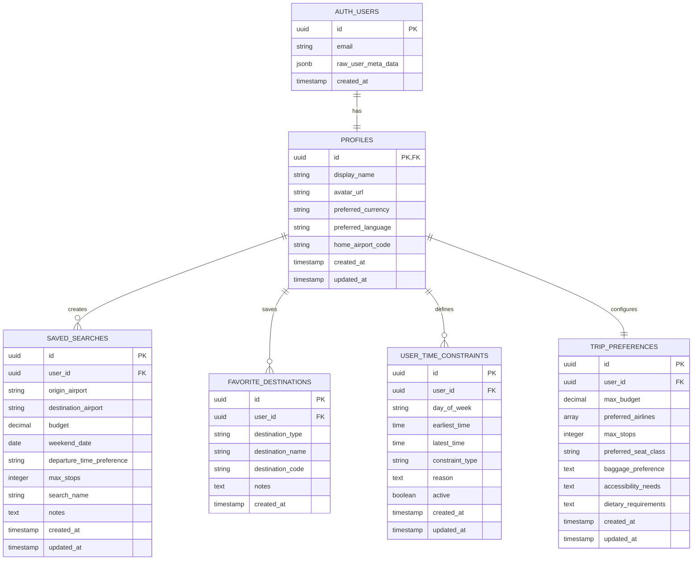

# Weekend Flight Finder - Database Documentation

**Last Updated:** 2025-11-15

## Database Schema Overview

This document provides a comprehensive overview of the Weekend Flight Finder database structure, including all tables, relationships, and security policies.

## Entity Relationship Diagram



## Table Descriptions

### 1. profiles
**Purpose:** Stores additional user information beyond authentication data.

**Columns:**
- `id` (UUID, PK) - References auth.users(id), automatically set on user creation
- `display_name` (TEXT) - User's display name
- `avatar_url` (TEXT) - URL to user's profile picture
- `preferred_currency` (TEXT) - Default: 'EUR'
- `preferred_language` (TEXT) - Default: 'en'
- `home_airport_code` (TEXT) - User's default departure airport (3-letter IATA code)
- `created_at` (TIMESTAMPTZ) - Profile creation timestamp
- `updated_at` (TIMESTAMPTZ) - Last update timestamp

**Relationships:**
- Parent: auth.users (CASCADE DELETE)
- Children: saved_searches, favorite_destinations, user_time_constraints, trip_preferences

**Constraints:**
- Primary key on `id`
- Foreign key to `auth.users(id)` with CASCADE DELETE

**Triggers:**
- `on_auth_user_created` - Automatically creates profile when user signs up
- `update_profiles_updated_at` - Updates `updated_at` on row modification

---

### 2. saved_searches
**Purpose:** Stores user's flight search parameters for quick re-access.

**Columns:**
- `id` (UUID, PK) - Unique identifier
- `user_id` (UUID, FK, NOT NULL) - References profiles(id)
- `origin_airport` (TEXT, NOT NULL) - Departure airport code
- `destination_airport` (TEXT) - Destination airport code (null for "anywhere")
- `budget` (DECIMAL(10,2)) - Maximum budget per person
- `weekend_date` (DATE) - Target weekend date
- `departure_time_preference` (TEXT) - Preferred departure time window
- `max_stops` (INTEGER) - Maximum number of stops, default: 1
- `search_name` (TEXT) - User-friendly name for the search
- `notes` (TEXT) - Additional notes or constraints
- `created_at` (TIMESTAMPTZ) - Search creation timestamp
- `updated_at` (TIMESTAMPTZ) - Last update timestamp

**Relationships:**
- Parent: profiles (CASCADE DELETE)

**Constraints:**
- Primary key on `id`
- Foreign key to `profiles(id)` with CASCADE DELETE
- NOT NULL on `user_id`, `origin_airport`

**Triggers:**
- `update_saved_searches_updated_at` - Updates `updated_at` on row modification

---

### 3. favorite_destinations
**Purpose:** Stores user's favorite cities and countries for quick access.

**Columns:**
- `id` (UUID, PK) - Unique identifier
- `user_id` (UUID, FK, NOT NULL) - References profiles(id)
- `destination_type` (TEXT, NOT NULL) - 'city' or 'country'
- `destination_name` (TEXT, NOT NULL) - Name of the destination
- `destination_code` (TEXT) - IATA code or country code
- `notes` (TEXT) - User notes about why they want to visit
- `created_at` (TIMESTAMPTZ) - Favorite creation timestamp

**Relationships:**
- Parent: profiles (CASCADE DELETE)

**Constraints:**
- Primary key on `id`
- Foreign key to `profiles(id)` with CASCADE DELETE
- CHECK constraint on `destination_type` IN ('city', 'country')
- UNIQUE constraint on (user_id, destination_name, destination_type)
- NOT NULL on `user_id`, `destination_type`, `destination_name`

---

### 4. user_time_constraints
**Purpose:** Stores user's time windows for departures/arrivals (e.g., school pickup constraints).

**Columns:**
- `id` (UUID, PK) - Unique identifier
- `user_id` (UUID, FK, NOT NULL) - References profiles(id)
- `day_of_week` (TEXT, NOT NULL) - Day constraint applies to
- `earliest_time` (TIME) - Earliest acceptable time
- `latest_time` (TIME) - Latest acceptable time
- `constraint_type` (TEXT, NOT NULL) - 'departure', 'arrival', or 'both'
- `reason` (TEXT) - Explanation (e.g., "School pickup at 3 PM")
- `active` (BOOLEAN) - Whether constraint is currently active, default: true
- `created_at` (TIMESTAMPTZ) - Constraint creation timestamp
- `updated_at` (TIMESTAMPTZ) - Last update timestamp

**Relationships:**
- Parent: profiles (CASCADE DELETE)

**Constraints:**
- Primary key on `id`
- Foreign key to `profiles(id)` with CASCADE DELETE
- CHECK constraint on `day_of_week` IN ('monday', 'tuesday', 'wednesday', 'thursday', 'friday', 'saturday', 'sunday', 'any')
- CHECK constraint on `constraint_type` IN ('departure', 'arrival', 'both')
- NOT NULL on `user_id`, `day_of_week`, `constraint_type`

**Triggers:**
- `update_time_constraints_updated_at` - Updates `updated_at` on row modification

**Example Use Case:**
```sql
-- Cannot depart before 5 PM on Fridays due to school pickup at 3 PM
INSERT INTO user_time_constraints (user_id, day_of_week, earliest_time, constraint_type, reason)
VALUES (
  'user-uuid',
  'friday',
  '17:00:00',
  'departure',
  'School pickup - children finish at 3 PM, need time to get to airport'
);
```

---

### 5. trip_preferences
**Purpose:** Stores user's general travel preferences.

**Columns:**
- `id` (UUID, PK) - Unique identifier
- `user_id` (UUID, FK, NOT NULL) - References profiles(id)
- `max_budget` (DECIMAL(10,2)) - Default maximum budget
- `preferred_airlines` (TEXT[]) - Array of preferred airline codes
- `max_stops` (INTEGER) - Default maximum stops, default: 1
- `preferred_seat_class` (TEXT) - Preferred cabin class
- `baggage_preference` (TEXT) - Baggage requirements
- `accessibility_needs` (TEXT) - Accessibility requirements
- `dietary_requirements` (TEXT) - Dietary preferences
- `created_at` (TIMESTAMPTZ) - Preferences creation timestamp
- `updated_at` (TIMESTAMPTZ) - Last update timestamp

**Relationships:**
- Parent: profiles (CASCADE DELETE)

**Constraints:**
- Primary key on `id`
- Foreign key to `profiles(id)` with CASCADE DELETE
- CHECK constraint on `preferred_seat_class` IN ('economy', 'premium_economy', 'business', 'first')
- UNIQUE constraint on `user_id` (one preference set per user)
- NOT NULL on `user_id`

**Triggers:**
- `update_trip_preferences_updated_at` - Updates `updated_at` on row modification

---

## Row Level Security (RLS) Policies

All tables have RLS enabled with policies ensuring users can only access their own data.

### Common Policy Pattern:
```sql
-- SELECT: Users can view their own data
CREATE POLICY "Users can view their own {table}"
  ON public.{table} FOR SELECT
  USING (auth.uid() = user_id);

-- INSERT: Users can create their own data
CREATE POLICY "Users can create their own {table}"
  ON public.{table} FOR INSERT
  WITH CHECK (auth.uid() = user_id);

-- UPDATE: Users can update their own data
CREATE POLICY "Users can update their own {table}"
  ON public.{table} FOR UPDATE
  USING (auth.uid() = user_id);

-- DELETE: Users can delete their own data
CREATE POLICY "Users can delete their own {table}"
  ON public.{table} FOR DELETE
  USING (auth.uid() = user_id);
```

### Profiles Table Exception:
```sql
-- Profiles uses id directly (not user_id) since it references auth.users
CREATE POLICY "Users can view their own profile"
  ON public.profiles FOR SELECT
  USING (auth.uid() = id);
```

---

## Database Functions

### 1. handle_new_user()
**Purpose:** Automatically creates a profile when a new user signs up.

**Trigger:** `on_auth_user_created` on `auth.users` table

**Logic:**
1. Extracts user metadata (name, avatar) from signup
2. Creates profile record with user's ID
3. Sets display_name from metadata or email
4. Sets avatar_url from OAuth provider if available

**Code:**
```sql
CREATE OR REPLACE FUNCTION public.handle_new_user()
RETURNS TRIGGER
LANGUAGE plpgsql
SECURITY DEFINER
SET search_path = public
AS $$
BEGIN
  INSERT INTO public.profiles (id, display_name, avatar_url)
  VALUES (
    NEW.id,
    COALESCE(NEW.raw_user_meta_data->>'full_name', NEW.raw_user_meta_data->>'name', NEW.email),
    NEW.raw_user_meta_data->>'avatar_url'
  );
  RETURN NEW;
END;
$$;
```

### 2. update_updated_at_column()
**Purpose:** Automatically updates `updated_at` timestamp on row modifications.

**Triggers:** Applied to tables with `updated_at` column:
- profiles
- saved_searches
- user_time_constraints
- trip_preferences

**Code:**
```sql
CREATE OR REPLACE FUNCTION public.update_updated_at_column()
RETURNS TRIGGER
LANGUAGE plpgsql
SECURITY DEFINER
SET search_path = public
AS $$
BEGIN
  NEW.updated_at = NOW();
  RETURN NEW;
END;
$$;
```

---

## Data Flow Examples

### User Signup Flow
```
1. User signs up via auth.signUp()
2. New row created in auth.users
3. Trigger fires: on_auth_user_created
4. handle_new_user() creates profile in public.profiles
5. User can now save searches, favorites, etc.
```

### Saving a Search Flow
```
1. User performs search on frontend
2. Frontend calls supabase.from('saved_searches').insert()
3. RLS policy checks: auth.uid() = user_id
4. If authorized, row inserted
5. Trigger fires: update_saved_searches_updated_at
6. updated_at set to NOW()
```

### Time Constraint Application Flow
```
1. User sets constraint: "Can't depart before 5 PM on Fridays"
2. Stored in user_time_constraints
3. Flight search algorithm queries constraints
4. Filters results to match user's time windows
5. Only shows compatible flights to user
```

---

## Indexes

Current indexes (automatically created by PostgreSQL):
- Primary key indexes on all tables
- Foreign key indexes on all `user_id` columns
- Unique indexes on:
  - `favorite_destinations(user_id, destination_name, destination_type)`
  - `trip_preferences(user_id)`

**Recommended Additional Indexes (for performance at scale):**
```sql
-- For faster search queries
CREATE INDEX idx_saved_searches_user_created 
  ON saved_searches(user_id, created_at DESC);

-- For faster favorite lookups
CREATE INDEX idx_favorites_user_type 
  ON favorite_destinations(user_id, destination_type);

-- For time constraint queries
CREATE INDEX idx_time_constraints_user_active 
  ON user_time_constraints(user_id, active) 
  WHERE active = true;
```

---

## Migration History

### Migration 001 - Initial Schema (2025-11-15)
- Created profiles table
- Created saved_searches table
- Created favorite_destinations table
- Created user_time_constraints table
- Created trip_preferences table
- Added RLS policies to all tables
- Created handle_new_user() function and trigger
- Created update_updated_at_column() function and triggers

### Migration 002 - Security Fix (2025-11-15)
- Fixed search_path for update_updated_at_column() function
- Added SECURITY DEFINER and SET search_path = public

---

## Best Practices

### When Adding New Tables:
1. Always reference `profiles(id)`, not `auth.users(id)`
2. Enable RLS immediately
3. Add all four CRUD policies (SELECT, INSERT, UPDATE, DELETE)
4. Use `auth.uid()` in policies to identify current user
5. Add CASCADE DELETE on foreign keys to profiles
6. Add `created_at` and `updated_at` timestamps
7. Apply `update_updated_at_column()` trigger if using `updated_at`
8. Update this documentation with ERD diagram

### When Adding Columns:
1. Consider default values for existing rows
2. Use appropriate NULL constraints
3. Add CHECK constraints for enum-like values
4. Update ERD diagram in this document

### Security Considerations:
1. Never expose auth.users table directly
2. Always use RLS on user data tables
3. Use SECURITY DEFINER carefully - only for trusted functions
4. Set search_path in SECURITY DEFINER functions
5. Validate all user input on client side before INSERT
6. Never store sensitive data in plain text

---

## Quick Reference

### Get User's Profile:
```typescript
const { data: profile } = await supabase
  .from('profiles')
  .select('*')
  .eq('id', user.id)
  .single();
```

### Save a Search:
```typescript
const { error } = await supabase
  .from('saved_searches')
  .insert({
    user_id: user.id,
    origin_airport: 'LHR',
    budget: 200,
    // ... other fields
  });
```

### Add Time Constraint:
```typescript
const { error } = await supabase
  .from('user_time_constraints')
  .insert({
    user_id: user.id,
    day_of_week: 'friday',
    earliest_time: '17:00',
    constraint_type: 'departure',
    reason: 'School pickup constraint',
  });
```

### Query with Profile:
```typescript
const { data: searches } = await supabase
  .from('saved_searches')
  .select(`
    *,
    profiles (
      display_name,
      home_airport_code
    )
  `)
  .eq('user_id', user.id);
```

---

## Contact & Support

For database schema questions or suggestions:
- Review this documentation first
- Check the ERD diagram for relationships
- Refer to migration history for changes
- Consult RLS policies for security rules

**Remember:** This documentation should be updated with every database schema change!
